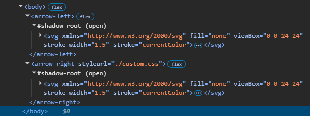

# web-component-stylesheet-import

An experiment on a better approach to dynamically import and inject stylesheet into web components.

### Example 

Declared

```html
<body>
  <arrow-left></arrow-left>
  <arrow-right styleurl="./custom.css"></arrow-right>
</body>
```
Rendered
> Notice how there is no <code>style</code> element here.




[Edit in StackBlitz next generation editor ⚡️](https://stackblitz.com/~/github.com/william-mba/web-component-stylesheet-import)